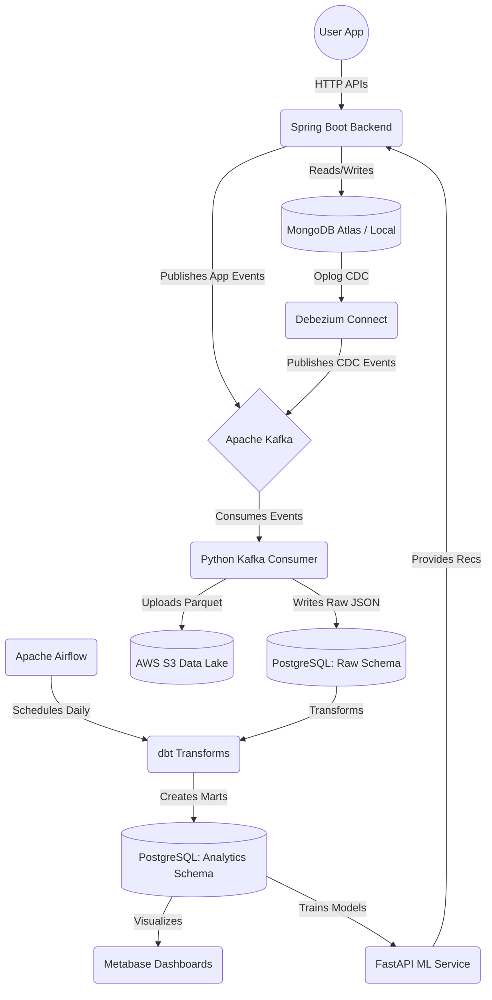

# 🏛️ Foodingo Data Pipeline Architecture

This document explains the components of the Foodingo Data Engineering Pipeline, their roles, and how data flows from the backend application through the pipeline to power Analytics and Machine Learning models.

---

## 🚀 Quickstart: How to Run the Entire Application

Follow these exact steps to boot up the entire infrastructure from scratch:

### 1. Configure Environment Variables
Ensure your `.env` file in the root directory is populated with your real AWS credentials (to allow S3 uploads).
```env
AWS_ACCESS_KEY="YOUR_ACTIVE_IAM_KEY"
AWS_SECRET_KEY="YOUR_ACTIVE_SECRET_KEY"
```

### 2. Boot the Docker Data Pipeline
Start all 14 containers. **Crucially, you must pass the `--env-file` flag** so the containers can read your AWS keys!
```bash

docker compose -f docker-compose-pipeline.yml --env-file .env up -d
```
*Wait about 60 seconds for everything to become "Healthy". Kafka, Zookeeper, and PostgreSQL take a moment to initialize.*

### 3. Register the Debezium CDC Connector
Once the containers are running, you must tell Kafka Connect to start spying on MongoDB by registering the connector:
```bash
curl -X POST http://localhost:8083/connectors \
  -H "Content-Type: application/json" \
  -d @debezium/mongodb-connector.json
```

### 4. Start the Spring Boot Backend
Navigate back to the root directory and boot up the Java application:
```bash
cd ..
./mvnw spring-boot:run
```

The entire system is now running! You can trigger events in the application (or via Postman) and watch them flow through the pipeline.

---

## 1. Why MongoDB and PostgreSQL?

In modern microservices and data pipelines, it's a common best practice to separate **OLTP** (Online Transaction Processing) from **OLAP** (Online Analytical Processing).

### 🍃 MongoDB (Operational Database / OLTP)
👉 **[Read the Detailed MongoDB Guide](mongodb/README.md)**
👉 **[Read the Atlas Backup Guide](atlas-backup/README.md)**
- **Role:** The primary database for the Spring Boot backend.
- **Why we use it:** Flexibility for dynamic schemas (menus, cart structures) and high-speed reads/writes for user-facing applications.
- **Limitation:** Not optimized for complex JOINs and aggregations. 

### 🐘 PostgreSQL (Data Warehouse / OLAP)
👉 **[Read the Detailed PostgreSQL Guide](postgres/README.md)**
- **Role:** The central analytical data warehouse.
- **Why we use it:** Excels at complex SQL queries and strictly typed relational schemas for data integrity.

---

## 2. Container Components & Interactions

For an in-depth understanding of each individual layer and its UI, click on the corresponding README links below:

### 🚀 Application Layer
1. **Spring Boot (Your Backend)**
   - Connects to MongoDB to serve user requests.
   - Pushes real-time application events directly to Kafka.

### 📨 Streaming & Messaging (Apache Kafka Ecosystem)
👉 **[Read the Detailed Kafka & Kafka UI Guide](kafka/README.md)**
2. **foodingo-zookeeper**: Manages broker metadata.
3. **foodingo-kafka**: The message broker that stores all events.
4. **foodingo-schema-registry**: Stores schema definitions.
5. **foodingo-kafka-ui**: Visual dashboard (`http://localhost:8090`).

### 🔄 Change Data Capture (CDC)
👉 **[Read the Detailed Debezium Guide](debezium/README.md)**
6. **foodingo-kafka-connect (Debezium)**
   - Listens to MongoDB's Oplog (Change Streams) in real-time.

### 🐍 Data Ingestion Layer
👉 **[Read the Detailed Kafka Consumer Guide](kafka-consumer/README.md)**
7. **foodingo-kafka-consumer (Custom Python Service)**
   - Constantly listens to all Kafka topics. Writes raw events to Postgres and batches Parquet files to S3.

### 🪣 Data Lake Layer
👉 **[Read the Detailed MinIO / S3 Guide](minio/README.md)**
8. **AWS S3 (or local MinIO)**
   - Cloud object storage for the Data Lake. 

### 🤖 Machine Learning & Analytics Layer
👉 **[Read the Detailed ML Service Guide](ml-service/README.md)**
9. **foodingo-ml-service (FastAPI)**
   - Connects to PostgreSQL to train ML models. Exposes `/recommend` and `/churn-risk`.

👉 **[Read the Detailed Metabase Guide](metabase/README.md)**
10. **foodingo-metabase**
    - Business Intelligence dashboard (`http://localhost:3000`). 

### ⏳ Orchestration Layer
👉 **[Read the Detailed Airflow Guide](airflow/README.md)**
👉 **[Read the Detailed dbt Guide](dbt/README.md)**
11. **foodingo-airflow-webserver & scheduler**
    - Task orchestrator (`http://localhost:8089`). Executes **dbt** (Data Build Tool) daily to transform data.
12. **foodingo-airflow-db**: Dedicated Postgres database for Airflow.

---

## 3. The Complete Data Flow Architecture



---

## 4. End-to-End Testing & Analysis Guide (The 7 Steps)

To verify the entire pipeline is working end-to-end, follow this exact sequence:

### Step 1: Trigger Application Events (Spring Boot)
Use Postman or your Frontend to trigger events in the application:
- **Register a user:** `POST /api/user/register`
- **Add to Cart:** `POST /api/cart/add`
*This pushes the data into MongoDB, which triggers Debezium, and also sends explicit business events directly to Kafka.*

### Step 2: Verify Kafka Ingestion (Kafka UI)
*Where to analyze: [http://localhost:8090](http://localhost:8090)*
1. Open Kafka UI and navigate to **Topics**.
2. Check `cart.item_added` (App Events) and `foodingo.foodies.orders` (CDC Events) to see the raw JSON.

### Step 3: Verify Data Warehouse Ingestion (PostgreSQL)
*Where to analyze: Connect DBeaver to `localhost:5432`, DB: `foodingo_warehouse`, User: `foodingo`*
1. Browse to the `raw` schema.
2. Query `SELECT COUNT(*) FROM raw.cart_events;` to see your structured cart actions.

### Step 4: Verify Data Lake Backups (AWS S3)
*Where to analyze: Your AWS Management Console -> S3*
1. Go to your `foodingo-data-lake` S3 Bucket in AWS.
2. Navigate to `raw/events/` to view your highly-compressed `.parquet` backups.

### Step 5: Run Analytics Transformations (Airflow + dbt)
*Where to analyze: [http://localhost:8089](http://localhost:8089)* (Login: `admin` / `admin`)
1. Open Airflow and unpause the `foodingo_daily_pipeline` DAG using the toggle switch.
2. Manually trigger the DAG by clicking the **Play button**.
3. Airflow executes `dbt run`, which transforms the JSON into clean, structured analytics tables (like `fact_orders` and `daily_revenue`) into the `analytics` PostgreSQL schema. 

### Step 6: Visualize the Data (Metabase)
*Where to analyze: [http://localhost:3000](http://localhost:3000)*
1. Open Metabase and complete the fast setup wizard (connecting it to Postgres `localhost:5432`).
2. Build dashboards on top of the newly generated `analytics` schema (e.g., query `analytics.daily_revenue`).

### Step 7: Test Machine Learning Predictions (ML Service)
*Where to analyze: [http://localhost:5001/docs](http://localhost:5001/docs)*
1. Open the ML Service Swagger UI.
2. Try the `/recommend/{user_id}` endpoint to execute a collaborative filtering algorithm against the analytics tables and predict food recommendations!
